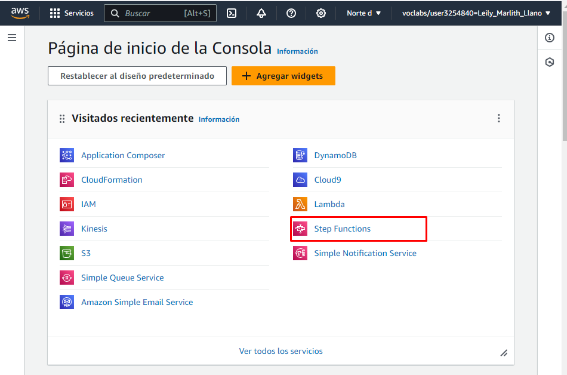

EJERCICIO N° 2

Desarrolla una máquina de estado que incluya estados de tarea y pasarela. Implementa estos estados utilizando Python y AWS SDK.

Añade estados de espera y elección a la máquina de estado. Utiliza condiciones para decidir el flujo de trabajo.

1,. Nos dirigimos al servicio de Step Function

2\.- Clik en empezar

3\.- Clik en “crear la suya propia”

4\.- Creamos nuestra máquina de estado

5\.- Clik en crear

{

`  `"Comment": "A description of my state machine",

`  `"StartAt": "Wait",

`  `"States": {

`    `"Wait": {

`      `"Type": "Wait",

`      `"Seconds": 5,

`      `"Next": "Choice"

`    `},

`    `"Choice": {

`      `"Type": "Choice",

`      `"Choices": [

`        `{

`          `"Variable": "$.condition",

`          `"BooleanEquals": true,

`          `"Next": "Pass"

`        `}

`      `],

`      `"Default": "Parallel"

`    `},

`    `"Pass": {

`      `"Type": "Pass",

`      `"End": true

`    `},

`    `"Parallel": {

`      `"Type": "Parallel",

`      `"Branches": [

`        `{

`          `"StartAt": "Cargar datos",

`          `"States": {

`            `"Cargar datos": {

`              `"Type": "Pass",

`              `"End": true

`            `}

`          `}

`        `},

`        `{

`          `"StartAt": "Limpiar datos",

`          `"States": {

`            `"Limpiar datos": {

`              `"Type": "Pass",

`              `"End": true

`            `}

`          `}

`        `},

`        `{

`          `"StartAt": "Analizar datos",

`          `"States": {

`            `"Analizar datos": {

`              `"Type": "Pass",

`              `"End": true

`            `}

`          `}

`        `}

`      `],

`      `"End": true

`    `}

`  `}

}

6\.-Clik en confirmar

7\.- Verificamos el servicio IAM

8\.- No tenemos acceso para crear un rol.

